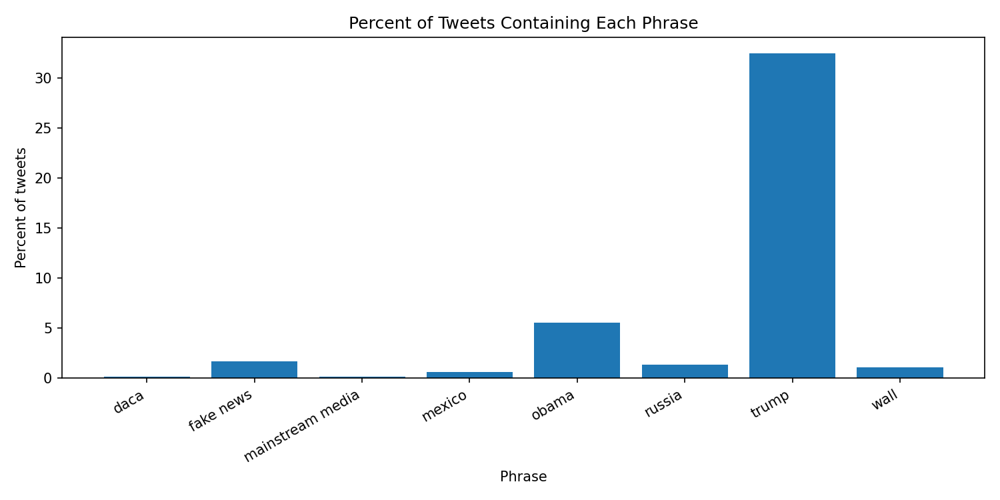
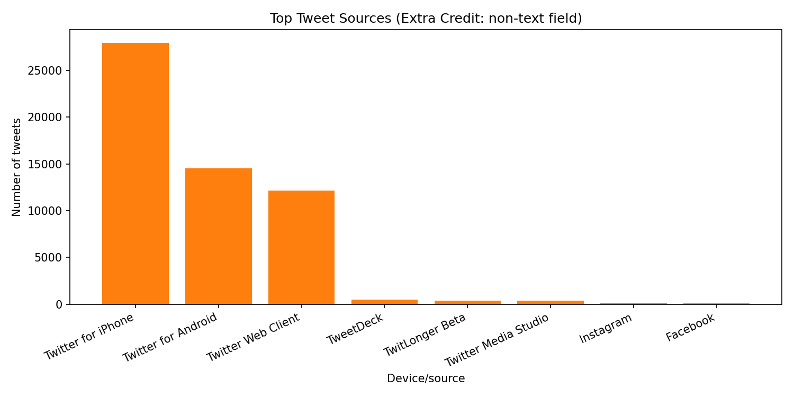

# Trump Tweet Phrase Analysis

This table and charts show phrase percentages and tweet-source trends in the Trump archive data.

## Dataset Verification

- Data source used: Google Drive JSON from TheTrumpArchive FAQ (https://drive.google.com/file/d/16wm-2NTKohhcA26w-kaWfhLIGwl_oX95/view?usp=sharing)
- Total records analyzed: 56571
- Date range in data: 2009-05-04 to 2021-01-08

## Phrase Percent Table

|           phrase | percent of tweets |
| ---------------- | ----------------- |
|             daca |             00.15 |
|        fake news |             01.66 |
| mainstream media |             00.11 |
|           mexico |             00.62 |
|            obama |             05.51 |
|           russia |             01.32 |
|            trump |             32.45 |
|             wall |             01.08 |

## Extra Credit Plot (non-text field)

